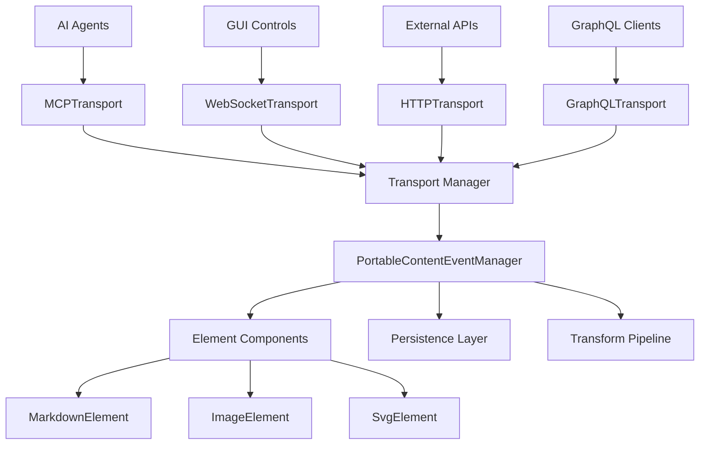

# Transport Layer Architecture for PortableContent Event System

This document outlines the transport abstraction layer that enables the PortableContentEventManager to communicate with diverse clients (AI agents, GUI controls, APIs) through multiple protocols while maintaining protocol independence.

## Architecture Overview

### Core Principle
**Separate transport concerns from event management logic through a clean abstraction layer.**

The transport layer acts as a protocol adapter between external systems and the PortableContentEventManager, enabling:
- Protocol-agnostic event management
- Multiple simultaneous transport protocols
- Easy testing and mocking
- Graceful fallback mechanisms
- Future protocol extensibility

## System Architecture



## Core Interfaces

### Transport Interface
```typescript
interface PortableContentTransport {
  readonly name: string;
  readonly capabilities: TransportCapabilities;
  
  // Connection management
  connect(): Promise<void>;
  disconnect(): Promise<void>;
  isConnected(): boolean;
  
  // Event handling
  sendEvent(event: ElementEvent): Promise<ElementEventResult>;
  sendBatchEvents(events: ElementEvent[]): Promise<BatchEventResult>;
  
  // Event subscription
  onEvent(callback: ElementEventCallback): UnsubscribeFunction;
  onBatchEvent(callback: BatchElementEventCallback): UnsubscribeFunction;
  onConnectionChange(callback: ConnectionChangeCallback): UnsubscribeFunction;
  
  // Transport-specific features
  getMetadata(): TransportMetadata;
  healthCheck(): Promise<HealthStatus>;
}

interface TransportCapabilities {
  supportsRealtime: boolean;
  supportsBatching: boolean;
  supportsSubscriptions: boolean;
  maxEventSize: number;
  maxBatchSize: number;
  supportedEventTypes: ElementEventType[];
}
```

### Element Event Model
```typescript
interface ElementEvent {
  // Core identification
  elementId: string; // Dynamic, generated UUID
  elementType: 'markdown' | 'image' | 'mermaid' | 'video' | 'document';
  eventType: ElementEventType;
  
  // Event data
  data: ElementEventData;
  metadata: ElementEventMetadata;
  
  // Processing flags
  persistChange?: boolean; // Update PortableContentManifest
  triggerTransforms?: boolean; // Generate new variants
  validateFirst?: boolean; // Validate against schema
}

type ElementEventType = 
  | 'updatePayload'     // Change PayloadSource content
  | 'updateProps'       // Change element properties
  | 'updateVariants'    // Modify available variants
  | 'updateStyle'       // Change visual styling
  | 'refreshTransforms' // Regenerate variants
  | 'validateContent';  // Validate element data

interface ElementEventMetadata {
  timestamp: number;
  source: 'ai' | 'gui' | 'api' | 'user' | 'system';
  priority: 'low' | 'normal' | 'high' | 'immediate';
  correlationId?: string;
  userId?: string;
  sessionId?: string;
}
```

## Transport Implementations

### 1. GraphQL Transport
```typescript
class GraphQLTransport implements PortableContentTransport {
  readonly name = 'graphql';
  readonly capabilities: TransportCapabilities = {
    supportsRealtime: true,
    supportsBatching: true,
    supportsSubscriptions: true,
    maxEventSize: 1024 * 1024, // 1MB
    maxBatchSize: 100,
    supportedEventTypes: ['updatePayload', 'updateProps', 'updateVariants']
  };

  constructor(
    private client: GraphQLClient,
    private subscriptionClient: SubscriptionClient
  ) {}

  async sendEvent(event: ElementEvent): Promise<ElementEventResult> {
    const mutation = gql`
      mutation UpdateElement($input: ElementEventInput!) {
        updateElement(input: $input) {
          success
          elementId
          errors
          updatedAt
        }
      }
    `;
    
    return await this.client.mutate({
      mutation,
      variables: { input: this.transformEvent(event) }
    });
  }

  onEvent(callback: ElementEventCallback): UnsubscribeFunction {
    const subscription = gql`
      subscription ElementUpdates($elementIds: [ID!]) {
        elementUpdated(elementIds: $elementIds) {
          elementId
          eventType
          data
          metadata
        }
      }
    `;
    
    return this.subscriptionClient.subscribe({
      query: subscription,
      next: (result) => callback(this.transformFromGraphQL(result.data))
    });
  }
}
```

### 2. WebSocket Transport
```typescript
class WebSocketTransport implements PortableContentTransport {
  readonly name = 'websocket';
  readonly capabilities: TransportCapabilities = {
    supportsRealtime: true,
    supportsBatching: true,
    supportsSubscriptions: true,
    maxEventSize: 512 * 1024, // 512KB
    maxBatchSize: 50,
    supportedEventTypes: ['updatePayload', 'updateProps', 'updateStyle']
  };

  constructor(private wsUrl: string) {}

  async connect(): Promise<void> {
    this.ws = new WebSocket(this.wsUrl);
    
    return new Promise((resolve, reject) => {
      this.ws.onopen = () => resolve();
      this.ws.onerror = (error) => reject(error);
      this.ws.onmessage = (message) => this.handleMessage(message);
    });
  }

  async sendEvent(event: ElementEvent): Promise<ElementEventResult> {
    const message = {
      type: 'element-event',
      payload: event,
      id: generateId()
    };
    
    return new Promise((resolve, reject) => {
      this.pendingRequests.set(message.id, { resolve, reject });
      this.ws.send(JSON.stringify(message));
    });
  }

  private handleMessage(message: MessageEvent): void {
    const data = JSON.parse(message.data);
    
    switch (data.type) {
      case 'element-event':
        this.eventCallbacks.forEach(callback => callback(data.payload));
        break;
      case 'element-event-result':
        this.handleEventResult(data);
        break;
    }
  }
}
```

### 3. MCP Transport (AI Agents)
```typescript
class MCPTransport implements PortableContentTransport {
  readonly name = 'mcp';
  readonly capabilities: TransportCapabilities = {
    supportsRealtime: false,
    supportsBatching: true,
    supportsSubscriptions: false,
    maxEventSize: 2 * 1024 * 1024, // 2MB for rich content
    maxBatchSize: 20,
    supportedEventTypes: ['updatePayload', 'updateProps', 'refreshTransforms']
  };

  constructor(private mcpClient: MCPClient) {}

  async sendEvent(event: ElementEvent): Promise<ElementEventResult> {
    // Convert to MCP tool call format
    const toolCall = {
      name: 'update_portable_content_element',
      arguments: {
        element_id: event.elementId,
        element_type: event.elementType,
        event_type: event.eventType,
        data: event.data,
        options: {
          persist_change: event.persistChange,
          trigger_transforms: event.triggerTransforms
        }
      }
    };

    const result = await this.mcpClient.callTool(toolCall);
    return this.transformMCPResult(result);
  }

  // MCP doesn't support subscriptions, so this is a no-op
  onEvent(callback: ElementEventCallback): UnsubscribeFunction {
    return () => {}; // MCP is request/response only
  }
}
```

## Transport Manager

```typescript
class PortableContentTransportManager {
  private transports = new Map<string, PortableContentTransport>();
  private activeTransports = new Set<string>();
  private eventManager: PortableContentEventManager;

  constructor(eventManager: PortableContentEventManager) {
    this.eventManager = eventManager;
  }

  // Transport registration
  registerTransport(transport: PortableContentTransport): void {
    this.transports.set(transport.name, transport);
    
    // Forward events from transport to event manager
    transport.onEvent((event) => {
      this.eventManager.handleExternalEvent(event);
    });
    
    transport.onBatchEvent((events) => {
      this.eventManager.handleExternalBatchEvents(events);
    });
  }

  // Connection management
  async connectTransport(name: string): Promise<void> {
    const transport = this.transports.get(name);
    if (!transport) throw new Error(`Transport ${name} not found`);
    
    await transport.connect();
    this.activeTransports.add(name);
  }

  async disconnectTransport(name: string): Promise<void> {
    const transport = this.transports.get(name);
    if (transport) {
      await transport.disconnect();
      this.activeTransports.delete(name);
    }
  }

  // Event broadcasting
  async broadcastEvent(event: ElementEvent, transportNames?: string[]): Promise<Map<string, ElementEventResult>> {
    const targets = transportNames || Array.from(this.activeTransports);
    const results = new Map<string, ElementEventResult>();

    await Promise.allSettled(
      targets.map(async (name) => {
        const transport = this.transports.get(name);
        if (transport && transport.isConnected()) {
          try {
            const result = await transport.sendEvent(event);
            results.set(name, result);
          } catch (error) {
            results.set(name, { success: false, error: error.message });
          }
        }
      })
    );

    return results;
  }

  // Health monitoring
  async healthCheck(): Promise<Map<string, HealthStatus>> {
    const health = new Map<string, HealthStatus>();
    
    for (const [name, transport] of this.transports) {
      try {
        const status = await transport.healthCheck();
        health.set(name, status);
      } catch (error) {
        health.set(name, { healthy: false, error: error.message });
      }
    }
    
    return health;
  }
}
```

## Integration with PortableContentEventManager

```typescript
class PortableContentEventManager {
  constructor(
    private transportManager: PortableContentTransportManager,
    private persistenceLayer: ContentPersistenceLayer,
    private transformPipeline: TransformPipeline
  ) {}

  // Handle events from external transports
  async handleExternalEvent(event: ElementEvent): Promise<ElementEventResult> {
    try {
      // Validate event
      const validation = await this.validateEvent(event);
      if (!validation.isValid) {
        return { success: false, errors: validation.errors };
      }

      // Apply to component
      const componentResult = await this.updateComponent(event);
      
      // Handle persistence if requested
      if (event.persistChange) {
        await this.persistenceLayer.updateElement(event.elementId, event.data);
      }
      
      // Trigger transforms if requested
      if (event.triggerTransforms) {
        await this.transformPipeline.queueTransforms(event.elementId, event.elementType);
      }

      return { success: true, elementId: event.elementId, updatedAt: Date.now() };
    } catch (error) {
      return { success: false, error: error.message };
    }
  }

  // Send events to external systems
  async sendToTransports(event: ElementEvent, transportNames?: string[]): Promise<void> {
    await this.transportManager.broadcastEvent(event, transportNames);
  }
}
```

## Usage Examples

### Setup
```typescript
// Initialize system
const eventManager = new PortableContentEventManager(transportManager, persistence, transforms);
const transportManager = new PortableContentTransportManager(eventManager);

// Register transports
transportManager.registerTransport(new GraphQLTransport(graphqlClient, subscriptionClient));
transportManager.registerTransport(new WebSocketTransport('ws://localhost:8080/events'));
transportManager.registerTransport(new MCPTransport(mcpClient));

// Connect transports
await transportManager.connectTransport('graphql');
await transportManager.connectTransport('websocket');
await transportManager.connectTransport('mcp');
```

### AI Agent Integration
```typescript
// AI agent sends content update via MCP
const aiEvent: ElementEvent = {
  elementId: 'markdown-element-abc123',
  elementType: 'markdown',
  eventType: 'updatePayload',
  data: {
    payload: {
      type: 'inline',
      mediaType: 'text/markdown',
      source: '# Updated by AI\n\nThis content was modified by an AI agent.'
    }
  },
  metadata: {
    timestamp: Date.now(),
    source: 'ai',
    priority: 'normal',
    correlationId: 'ai-session-456'
  },
  persistChange: true,
  triggerTransforms: true
};

// Event flows: MCP → TransportManager → EventManager → Component + Persistence + Transforms
```

### GUI Control Integration
```typescript
// Color picker sends real-time updates via WebSocket
const colorEvent: ElementEvent = {
  elementId: 'markdown-element-abc123',
  elementType: 'markdown',
  eventType: 'updateStyle',
  data: {
    style: { backgroundColor: '#ff6b6b' }
  },
  metadata: {
    timestamp: Date.now(),
    source: 'gui',
    priority: 'high'
  },
  persistChange: false, // Don't persist real-time color changes
  triggerTransforms: false
};

// High-frequency updates are queued and batched automatically
```

## Benefits of This Architecture

1. **Protocol Independence**: EventManager doesn't know about GraphQL, WebSocket, or MCP
2. **Easy Testing**: Mock transports for unit tests
3. **Scalable**: Add new protocols without changing core logic
4. **Resilient**: Transport failures don't break the system
5. **Flexible**: Different transports for different use cases
6. **Future-Proof**: Easy to add new communication protocols

## Next Steps

1. Implement base transport interface and manager
2. Create GraphQL transport for web clients
3. Add WebSocket transport for real-time updates
4. Implement MCP transport for AI agents
5. Add HTTP transport as fallback
6. Create comprehensive testing suite
7. Add monitoring and health checks
8. Document protocol-specific integration guides

This architecture provides a solid foundation for multi-protocol communication while keeping the core event system clean and maintainable.
